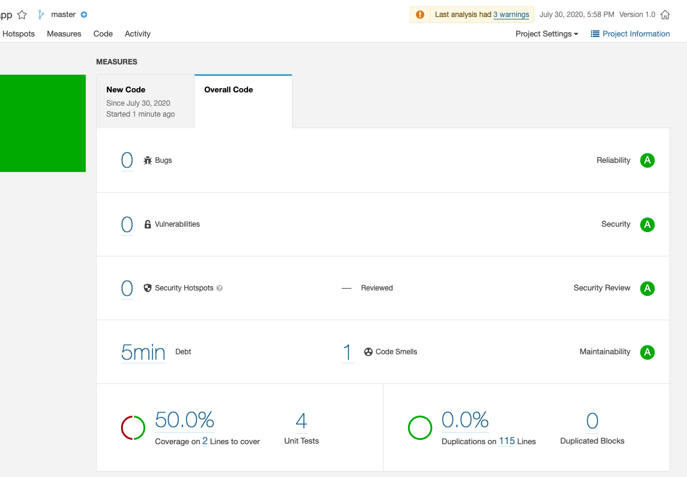

# Funcionando los Coverage Test
Lo prometido es deuda.
Ya está funcionado... y básicamente lo único que hice fue cambiar la verisón de JUNIT por una más moderna.
He actualizado en el fichero POM la **dependencia de JUNIT** poninendo la **versión 4.10** 
Lo siguiente que he cambiado ha sido el **fichero CalculadoraTest**. Aquí en el git teneis el fichero modificado para acomodarlo a la versión 4 de JNUIT.
Posteriormente he ejecutado en el terminal:
- mvn clean package
- **mvn jacoco:report  (Este creo que no lo habíamos llegado a ejecutar)**
- mvn -s ../settings.xml sonar:sonar
Y Listo:

Cualquier cosa me escribís por email :)
